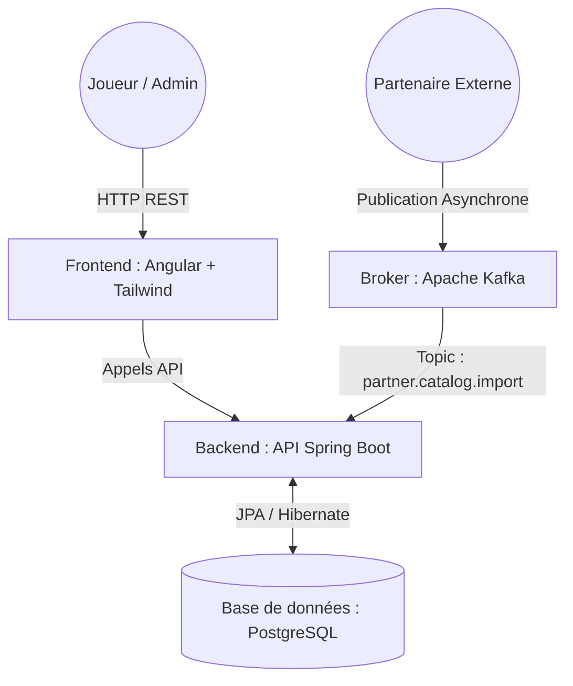

# 📄 Documentation de conception - Plateforme STAM

| Propriété | Valeur |
| :--- | :--- |
| **État** | TERMINÉ |
| **Impact** | ELEVÉ |
| **Driver (meneur)** | @Mathéo Chahwan |
| **Evaluateur** | @David Thibau |
| **Contributeurs** | @Norig CISERANI, @Mathéo Chahwan, @Yohann PECH, @Mohamadou-eddaly Kebe |
| **Date d'échéance** | 24 avril 2026 |
| **Date de dernière mise à jour** | 19 février 2026 |

---

## 1. Vision et Objectifs du Produit

### 1.1. Le Besoin et la Motivation
Le marché du jeu vidéo est aujourd'hui hautement fragmenté. Les joueurs consultent de multiples plateformes pour suivre les sorties, tandis que les éditeurs et distributeurs (B2B) peinent à unifier la diffusion de leurs catalogues en temps réel. **STAM** naît de ce constat : créer un point d'entrée unique, centralisé et ultra-performant pour référencer le marché vidéoludique. 

L'innovation technique majeure (valeur ajoutée) réside dans notre moteur d'ingestion de données : grâce à Apache Kafka, STAM permet aux partenaires d'injecter des milliers de références de jeux simultanément et de manière asynchrone, garantissant un catalogue toujours à jour sans jamais dégrader les performances de navigation des joueurs.

### 1.2. Modèle Économique (Business Model)
Notre modèle hybride B2C / B2B garantit la viabilité financière de la plateforme :
* **B2C (Freemium pour les Joueurs) :** L'accès au catalogue et aux filtres de base est 100% gratuit pour attirer du trafic. Une offre "Premium" (abonnement mensuel) permet de supprimer les publicités, de créer des listes de souhaits illimitées et de recevoir des alertes personnalisées.
* **B2B (Monétisation de l'API & Affiliation) :** Les partenaires (éditeurs, boutiques) paient un abonnement SaaS pour accéder à notre API d'ingestion Kafka haut débit afin de mettre en avant leurs titres. De plus, la plateforme intègre des liens d'affiliation générant une commission à chaque jeu acheté via STAM.

### 1.3. Profils Utilisateurs
* **Le Joueur (Client B2C) :** Navigue sur la plateforme en lecture seule pour consulter le catalogue et filtrer les jeux.
* **L'Administrateur (Interne) :** Possède les droits d'écriture via l'interface Front-end pour modérer, ajouter ou supprimer manuellement un jeu.
* **Le Partenaire Externe (Client B2B / Système) :** Interagit de manière purement programmatique et asynchrone en publiant des lots de jeux directement dans le cluster Kafka.
---

## 2. Schéma d'Architecture Globale

* À gauche : Le flux classique et synchrone (le joueur qui navigue sur le Front Angular, qui appelle l'API).

* À droite : Le flux asynchrone pour l'ingestion massive (les partenaires qui poussent les jeux dans Kafka, et le Backend qui écoute).

* En bas : La base de données PostgreSQL centralisée pour stocker tout le catalogue.

## 3. Choix Technologiques & Architecture Globale

Nous avons opté pour une architecture Monolithe Modulaire + Broker de messages, répartie sur une Organisation GitHub contenant 3 dépôts Git séparés pour garantir un découplage strict entre la documentation/infrastructure, le client et l'API.

| Composant | Technologie choisie | Justification technique et stratégique |
| :--- | :--- | :--- |
| **Backend (API)** | Java / Spring Boot | Standard industriel robuste, écosystème riche (Spring Data, Spring Kafka). Typage fort et sécurité intégrée. |
| **Frontend (Client)** | Angular 21 + Tailwind CSS | Framework complet. L'utilisation de TypeScript garantit une forte cohérence avec notre backend Java (paradigme orienté objet, typage). Utilisation de Tailwind CSS pour la librairie de style. |
| **Base de données** | PostgreSQL | SGBD relationnel garantissant l'intégrité des données (ACID), idéal pour un catalogue structuré avec des relations (Jeux, Genres, Éditeurs). |
| **Messaging (Asynchrone)** | Apache Kafka | Permet l'ingestion massive de données sans bloquer l'API REST. Découplage fort entre les producteurs de données (partenaires) et notre base. |
| **DevOps & Déploiement** | 3 Dépôts Git / GitHub Actions | Séparation claire : un repo central (Docs/Infra), un repo Back, un repo Front. Chaque dépôt applicatif possède sa propre pipeline CI/CD isolée. |

### Plateforme DevOps & Chaîne de Production

* **Gestion du code** : Organisation GitHub avec 3 dépôts distincts pour séparer les cycles de vie.

* **Gestion des Merge Requests (MR)** : Utilisation systématique de Pull Requests. La fusion vers main est conditionnée par une revue de code et le succès des tests automatisés (CI).

* **Stratégie de Packaging** : Conteneurisation de chaque composant (Docker). Le Backend et le Frontend sont encapsulés dans des images légères (Alpine/Nginx) pour garantir la portabilité.

* **Pipeline CI/CD (GitHub Actions)** :

    * **CI (Intégration Continue)** : Build Maven/npm et exécution des tests unitaires à chaque push.

    * **Dépôt d'artefacts** : Publication des images Docker sur GitHub Packages à chaque version stable.

* **Politique de "Build Failure"** : La pipeline CI/CD est configurée de manière stricte : toute erreur détectée lors des phases de compilation, de tests unitaires ou de vérification de sécurité entraîne l'arrêt immédiat (fail-fast) du processus. Aucun déploiement n'est possible si l'artéfact n'est pas 100% valide.

* **Continuous Delivery** : Déploiement automatisé via docker-compose sur l'environnement cible une fois l'image validée.

## 4. Modèle de Données (Entités Principales)

Le modèle de base de données est volontairement centré sur le besoin principal du MVP : le catalogue.

Game (Table principale) :

    id (UUID, PK)

    title (String, Not Null)

    description (Text)

    releaseYear (Integer)

    genre_id (FK)

    price (Float)

Genre (Table de référence) :

    id (Long, PK)

    name (String, Unique) - ex: RPG, Action, Stratégie

## 5. Architecture de Distribution (Flux Kafka)

L'intégration de Kafka répond au besoin critique de mise à jour du catalogue par des entités tierces.

    Topic Kafka : partner.catalog.import

    Format des messages : JSON

    Fonctionnement (Consumer) : Notre backend Spring Boot écoute ce topic via l'annotation @KafkaListener. Lorsqu'un partenaire (simulé par un script ou un endpoint spécifique) publie une liste de jeux en JSON, le backend intercepte le message, valide les données via des DTOs, et insère les jeux en base de données de manière asynchrone.
## 6. Backlog Produit & Périmètre MVP

Pour assurer un développement itératif, nous distinguons la vision finale du produit (Backlog complet) du périmètre restreint de notre Minimum Viable Product (MVP).

### 6.1. Backlog du Produit Final (Vision cible - Hors MVP)
Afin d'offrir un produit complet à terme, les fonctionnalités suivantes sont planifiées post-MVP :
* **E-commerce & Affiliation :** Redirection vers les boutiques partenaires avec tracking d'achat.
* **Système Social :** Création de profils joueurs, avis, notes (reviews) et listes d'envies (wishlists).
* **Moteur de recommandation :** Suggestion de jeux basée sur l'historique de consultation de l'utilisateur.
* **Back-Office Partenaires :** Dashboard d'analyse des intégrations Kafka pour les éditeurs.

### 6.2. Périmètre du MVP (User Stories détaillées)
Le découpage suivant représente le périmètre strict de notre MVP pour la livraison de ce projet.

**Epic 1 : Consultation du Catalogue (Front/Back)**
* **US 1.1 :** En tant qu'utilisateur, je veux voir la liste des jeux vidéo pour découvrir le catalogue.
    * *Critères d'acceptation :* Appel à `GET /api/games`, affichage sous forme de grille, pagination fonctionnelle.
* **US 1.2 :** En tant qu'utilisateur, je veux voir le détail d'un jeu précis.
    * *Critères d'acceptation :* Appel à `GET /api/games/{id}`, affichage du prix, description et genre.
* **US 1.3 :** En tant qu'utilisateur, je veux filtrer la liste par genre ou par année.

**Epic 2 : Gestion du Catalogue (Front/Back - Admin)**
* **US 2.1 :** En tant qu'admin, je veux ajouter un jeu manuellement via un formulaire Angular.
    * *Critères d'acceptation :* Formulaire avec validation front-end, appel à `POST /api/games`, message de succès.
* **US 2.2 :** En tant qu'admin, je veux modifier ou supprimer un jeu obsolète (API: `PUT` et `DELETE`).

**Epic 3 : Ingestion Partenaire (Kafka)**
* **US 3.1 :** En tant que système, je veux consommer les messages du topic Kafka et les enregistrer en BDD de manière asynchrone.
* **US 3.2 :** En tant qu'évaluateur, je veux pouvoir déclencher l'envoi d'un jeu test dans Kafka pour prouver le fonctionnement de bout en bout de la pipeline d'ingestion.
---

## 8. Stratégie DevOps & Industrialisation

L'architecture s'appuie sur trois dépôts Git distincts au sein de notre Organisation GitHub, chacun ayant un rôle précis.

### Dépôt Central (`stam-projet`)
* Contient la documentation globale du projet (Document de conception, architecture).
* Héberge le fichier `docker-compose.yml` d'infrastructure de bout en bout, qui organise le lancement du Frontend, du Backend, de la BDD et de Kafka pour l'évaluation et la production.

### Dépôt Backend (`stam-api`)
* Contient le code Spring Boot.
* **CI/CD :** À chaque PR/Push sur `main`, la pipeline exécute le build Maven, les tests (JaCoCo >= 70%), et génère l'image Docker du backend.
* Contient un `docker-compose.yml` local restreint (PostgreSQL + Kafka) uniquement pour faciliter le développement de l'API en local.

### Dépôt Frontend (`stam-front`)
* Contient le code source Angular.
* **CI/CD :** À chaque PR/Push sur `main`, la pipeline exécute le build Angular (`npm run build`), les tests Front, et génère une image Docker Nginx contenant les fichiers statiques.

### Règles communes de versioning et Processus de Livraison
La branche `main` est protégée sur l'ensemble de l'organisation. Aucune fusion n'est permise sans une PR approuvée et une CI au statut "Passed" (Smart Commits liés à Jira). Le passage en environnement de test/prod est strictement contrôlé :

* **Merge Request (MR) obligatoire** : Pour effectuer une livraison, une MR vers la branche `dev` (ou `main`) est impérative.
* **Validation par les pairs** : Chaque MR nécessite au moins une validation d'une autre personne et le passage réussi de la pipeline de "Build Failure" (Tests unitaires + Compilation).
* **Livraison en Intégration** : Dans cette phase initiale, la livraison en intégration se traduit par la validation globale du code. La pipeline GitHub Actions construit l'image Docker de l'application. Une livraison réussie signifie qu'une image stable, testée et versionnée est prête à être déployée.

### 8.1. Pipeline de Déploiement Continu (CD) et Gestion des containers

Notre stratégie de Déploiement Continu (CD) vise à automatiser entièrement la livraison du code, de sa validation jusqu'à sa mise à disposition pour le serveur de prod. Ce processus repose sur la standardisation des livrables.

Voici le cycle de livraison automatisé en 2 phases clés :

* **Phase 1 : Conteneurisation**
Une fois le code validé par l'Intégration Continue (CI), la pipeline GitHub Actions prend le relais pour packager l'application. Au lieu de livrer le code source brut, l'action génère une image Docker. Ce processus garantit que l'application est livrée dans un environnement d'exécution pré-configuré avec toutes ses dépendances, éliminant ainsi les problèmes d'incompatibilité entre environnements.

* **Phase 2 : Déploiement**
Pour garantir la sécurité de l'infrastructure, le serveur cible n'a jamais accès au code source ni aux outils de compilation (Java, Node.js). Le déploiement s'appuie exclusivement sur notre manifest d'Infra-as-Code (`docker-compose.yml`). La mise en ligne se résume à une opération standardisée :
  * `docker compose up -d --build` : Le moteur Docker construit et redémarre les services concernés avec les nouvelles versions, de manière fluide et en préservant l'intégrité des bases de données associées.

---

## 9. Méthodologie Agile & Planning des Sprints

Le projet est géré selon la méthodologie Scrum, garantissant un développement itératif, équilibré, et centré sur la valeur.

### 9.1. Cérémonies Agiles Appliquées
* **Sprint Planning :** Au début de chaque sprint, l'équipe évalue sa capacité et sélectionne les User Stories du Backlog MVP à implémenter. Attribution des tickets Jira.
* **Daily Scrum (Asynchrone/Synchrone) :** Point rapide quotidien pour partager l'avancement, les points de blocage et synchroniser les dépôts Front/Back.
* **Sprint Review & Retrospective :** En fin de sprint, démonstration du code livré (incrément) et analyse de nos process DevOps pour les améliorer au sprint suivant.

### 9.2. Séquencement des Sprints
* **Sprint 0 (19 Fév - 26 Fév) : "Setup & Fondations"**
    * *Objectifs :* Document de conception, architecture repo Git sécurisée, pipelines CI/CD (GitHub Actions) au vert, socle Spring Boot & Angular, configuration des tests.
* **Sprint 1 (27 Fév - 12 Mars) : "Cœur Backend & Kafka"**
    * *Objectifs :* Modélisation BDD, API REST fonctionnelle (CRUD Jeux), Producer/Consumer Kafka opérationnels avec Testcontainers.
* **Sprint 2 (13 Mars - 27 Mars) : "Intégration Front & MVP"**
    * *Objectifs :* Application Angular branchée sur l'API, formulaires de gestion, démonstration de bout en bout du flux synchrone et asynchrone.
* **Sprint 3 (28 Mars - 24 Avril) : "Robustesse & Industrialisation"**
    * *Objectifs :* Sécurisation des routes API, couverture de tests >70%, gestion des erreurs avancée, Release 1.0 packagée sur Docker Hub/GitHub Packages pour la soutenance.
---

## 10. Stratégie d'Observabilité et Monitoring

Pour garantir la maintenabilité, l'analyse des performances et le débogage en environnement distribué (API + Kafka), nous avons opté pour une stack d'observabilité de pointe basée sur les standards de l'industrie (OpenTelemetry) et l'écosystème Grafana.

### Architecture du Monitoring
Le système repose sur un flux de données standardisé, découplant la génération de la donnée de son stockage :

1. **Instrumentation (Spring Boot) :** Le backend Java est instrumenté (via Micrometer et les dépendances OpenTelemetry) pour exposer ses métriques (CPU, requêtes HTTP, lag Kafka) et ses logs au format standard OTLP (OpenTelemetry Protocol).
2. **Collecteur (OTEL Collector) :** Un conteneur intermédiaire reçoit les flux OTLP de l'application, les traite, et les dispatche vers les bonnes bases de données temporelles.
3. **Stockage Métriques (Grafana Mimir) :** Stockage hautement disponible et scalable des métriques (compatible Prometheus).
4. **Stockage Logs (Grafana Loki) :** Agrégation de logs ultra-légère et indexée, parfaitement intégrée à l'écosystème.
5. **Visualisation (Grafana) :** L'interface unique permettant de croiser les requêtes (via LogQL et PromQL) pour diagnostiquer les incidents en temps réel.
