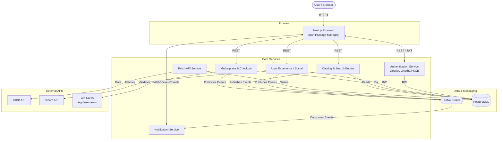

# Design Document

## 1. Functional Vision

### Motivation
The platform is designed to be a comprehensive digital marketplace for video game keys. It addresses the need for a centralized, secure, and user-friendly ecosystem where gamers can seamlessly purchase primary keys, resell their digital items peer-to-peer, and discover new titles based on real-time data and Steam profile connections. The added value lies in combining standard e-commerce features (shopping cart, gift card integration) with deep community features (gamification, personalized recommendations, real-time price drop notifications).

### User Profiles
* **Guest User:** Can browse the game catalog, perform basic searches, and view trending titles.
* **Registered User (Gamer):** Can securely buy and resell game keys, use gift cards, earn seniority badges, sync their Steam account for personalized recommendations, and receive real-time notifications for price drops via Kafka streams.
* **Administrator:** Oversees marketplace operations, manages the game catalog data, acts on observability metrics (Grafana/Elasticstack), and moderates peer-to-peer transactions.

### Backlog & Scoping
All **Epics** guiding the product development are defined in the [`docs/agile/epics/`](./agile/epics/) directory:
* [Infrastructure](./agile/epics/epic-infrastructure.md)
* [Authentication](./agile/epics/epic-authentication.md)
* [Catalog Data](./agile/epics/epic-catalog.md)
* [Marketplace](./agile/epics/epic-marketplace.md)
* [Notifications](./agile/epics/epic-notifications.md)
* [User Experience](./agile/epics/epic-user-experience.md)

Detailed **User Stories** are maintained as individual markdown files in the [`docs/agile/user-stories/`](./agile/user-stories/) directory. 
*(Note: Technical tasks implementing these stories are tracked exclusively as GitHub Issues.)*

---

## 2. Organization and Planning

The development cycle is organized into structured sprints. The exhaustive schedule and sprint goals can be found in the [Sprint Planning](./agile/sprint-planning.md) document.

---

## 3. Architecture and Technical Stack

### Software Architecture

The platform follows a microservices architecture to ensure high scalability and decoupling of complex domains.

**Component Description:**
* **Frontend:** A responsive Next.js application, managed via the Bun package manager. It acts as the primary interface, displaying real-time data and interacting with backend microservices.
* **Authentication Service:** A dedicated Laravel server implementing OAuth2 and the PKCE authorization flow for secure sessions.
* **Marketplace:** Responsible for standard transactions, shopping carts, and the peer-to-peer digital key resell logic.
* **Catalog Service:** Handles search queries and complex filtering against the persistent game database.
* **Fetch API Service:** An internal worker consistently syncing external game data from the IGDB API into the PostgreSQL database.
* **Notification Service:** Listens to Kafka topics (e.g., specific price drops) and pushes real-time alerts to connected frontend clients.
* **User Experience Service:** Evaluates trends, manages seniority badges, and fetches Steam API profiles for precise recommendations.
* **Kafka Broker:** The asynchronous event bus connecting actions from the marketplace and catalog directly to the notification engine.
* **PostgreSQL:** The definitive central persistent storage for the catalog, transactions, and user data.

### DevOps Platform

The infrastructure embraces a modern DevOps culture, relying heavily on automation, code reviews, and container orchestration.

* **Source Control & Task Management:** The source code is hosted on GitHub. Tasks, features, and bugs are managed exclusively via **GitHub Issues**. Code integration is managed via branch protection rules and **Merge Requests (Pull Requests)**.
* **Infrastructure as Code (IaC):** Cloud resources are provisioned automatically using **Terraform**, while server configurations and dependencies are defined using **Ansible**.
* **Containerization & Orchestration:** The entire suite of microservices is containerized using **Docker**. Deployment orchestration across pre-production and production environments is handled by a **Kubernetes (K8s)** cluster.
* **CI/CD Pipeline:** Automated pipelines catch errors early:
  * *Continuous Integration (CI):* Runs formatting checks, unit tests, and builds container images on every commit.
  * *Continuous Delivery (CD):* Automatically deploys successful pipeline artifacts to the pre-production Kubernetes cluster. Production rollouts are manually triggered by release tags.
* **Observability:** Health monitoring is deeply integrated. A centralized observability stack uses **Grafana** to monitor real-time infrastructure metrics and **Elasticstack** for distributed log aggregation across all microservices.
