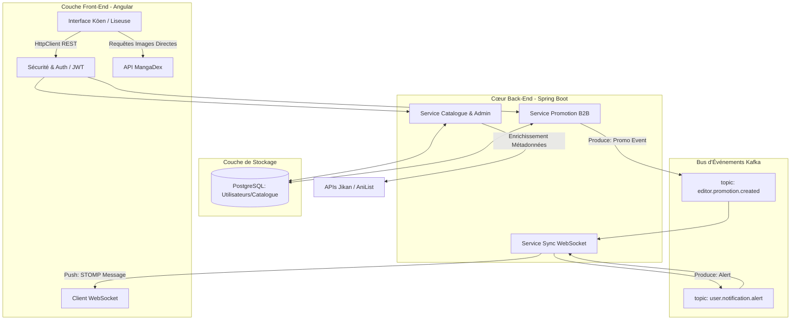

# Document de Conception Technique et Fonctionnelle : Kōen

Ce document détaille l'architecture, la vision fonctionnelle et les choix techniques de **Kōen**, une plateforme innovante dédiée à la lecture de mangas et d'animes. Il a été rédigé dans le cadre de l'évaluation du projet de fin d'études.

---

## 1. Vision Fonctionnelle

### 1.1. Motivation Business
**Kōen (公園)** est né d'un constat simple au sein de notre équipe de passionnés : l'écosystème actuel du "scantrad" (scans traduits) et de la découverte d'animes offre une expérience utilisateur désastreuse. Les sites sont saturés de publicités intrusives, de pop-ups malveillants et d'interfaces peu intuitives.

* **Objectifs :** Assainir la lecture en ligne avec une plateforme épurée, centralisée et fluide.
* **Le Modèle B2B (Notre valeur ajoutée) :** Pour garantir une navigation **100% gratuite et sans aucune publicité** pour le lecteur, Kōen repose sur un modèle économique alternatif. Les "Éditeurs" (créateurs, équipes de traduction) paient pour mettre en avant leurs œuvres via des bannières sponsorisées natives.

### 1.2. Profils Utilisateurs
Le système est conçu autour de trois rôles distincts pour soutenir cet écosystème :

| Rôle | Permissions | Cas d'usage principal |
| --- | --- | --- |
| **Visiteur** | Consulter les mangas/scans et animes. | Accès en lecture seule à tout le catalogue. Navigation libre et sans publicité. |
| **Éditeur** | Promouvoir du contenu via paiement. | Mise en avant payante de certains titres pour gagner en visibilité (Modèle B2B). |
| **Administrateur**| Ajouter, modifier et gérer les mangas. | Gestion complète du catalogue, des métadonnées et modération de la plateforme. |

### 1.3. Backlog et User Stories

L'effort principal de développement est concentré sur la réalisation du MVP (Minimum Viable Product) pour valider notre modèle et notre architecture technique.

####  Périmètre du MVP (Version 1.0.0)
1. **US01 - Consultation :** En tant que Visiteur, je veux afficher le catalogue d'anime/manga avec des filtres et une recherche avancée.
2. **US02 - Lecture de Scans :** En tant que Visiteur, je veux lire des scans via une liseuse fluide alimentée directement par l'API MangaDex.
3. **US03 - Authentification :** En tant qu'utilisateur, je veux m'authentifier (via JWT) pour accéder aux permissions de mon rôle (Éditeur, Administrateur).
4. **US04 - Dashboard Admin :** En tant qu'Administrateur, je veux utiliser une interface CRUD pour gérer les œuvres du catalogue local.
5. **US05 - Promotion B2B :** En tant qu'Éditeur, je veux utiliser une interface dédiée pour payer et promouvoir mes œuvres.
6. **US06 - Notifications Live :** En tant que Visiteur, je veux recevoir une notification en temps réel (via WebSocket/Kafka) lorsqu'une nouvelle promotion est activée.

####  Futures Versions (Post-MVP)
7. **US07 - Suivi utilisateur :** En tant que Visiteur, je veux sauvegarder ma progression de lecture et mes favoris.
8. **US08 - Métriques Éditeur :** En tant qu'Éditeur, je veux consulter les statistiques (clics, vues) de mes promotions.

---

## 2. Organisation et Planning

Pour la gestion de projet, nous utilisons **GitHub Projects** (directement lié à notre code pour le suivi des tickets), **Excalidraw** pour les diagrammes d'architecture, et **Notion** pour la rédaction préparatoire.

### Planification Détaillée
Le développement est découpé en Sprints Agile. Pour consulter le détail complet des tâches, des livrables et des objectifs par itération, veuillez vous référer à notre document de planification :
 **[Planification détaillée des Sprints (MVP)](./sprints_details.md)**

*Résumé de notre feuille de route :*

| Sprint | Objectif Principal | Tâches Clés |
| --- | --- | --- |
| **Sprint 0** | **Environnement & DevOps** | Setup du Monorepo GitHub, création du `docker-compose.yml` (PostgreSQL, Kafka), CI/CD GitHub Actions. |
| **Sprint 1** | **Backend & Données** | Setup Spring Boot, modélisation JPA/Hibernate, Spring Security (JWT), intégration Jikan/AniList. |
| **Sprint 2** | **Frontend & Liseuse** | Setup Angular, intégration ZardUI, création du Dashboard, connexion directe à MangaDex API. |
| **Sprint 3** | **Événementiel & Temps Réel** | Déploiement cluster Kafka, Topics d'événements, intégration WebSockets pour les notifications. |
| **Sprint 4** | **MVP Release** | Tests d'intégration, correction de bugs, validation des pipelines et préparation de la soutenance. |

---

## 3. Architecture et Stack Technique

### 3.1. Architecture Logicielle

Le système est découpé en services faiblement couplés. Le Front-End décharge le serveur en récupérant les médias lourds directement depuis des APIs externes, tandis que le Back-End orchestre la logique métier (CRUD, Auth) et les événements asynchrones via Apache Kafka.

### 3.2. Justification de la Stack Technique

Chaque technologie a été choisie pour répondre à un besoin métier précis ou pour challenger l'équipe techniquement.

#### Frontend
| Technologie | Catégorie | Justification du choix |
| --- | --- | --- |
| **Angular** | Framework | L'architecture modulaire et le typage fort de **TypeScript** facilitent le travail en équipe et réduisent les bugs. |
| **ZardUI** | Composants | Bibliothèque prête à l'emploi permettant d'obtenir un rendu propre et responsive rapidement. |
| **HttpClient** | Communication API | Module natif Angular, parfaitement adapté pour communiquer avec notre backend REST Spring Boot. |

#### Backend & Temps Réel
| Technologie | Catégorie | Justification du choix |
| --- | --- | --- |
| **Spring Boot** | Framework API | Référence robuste et standard de l'industrie (Java) pour la création d'APIs REST sécurisées. |
| **Spring Security** | Sécurité | Gestion de l'authentification stateless via **JWT**, indispensable pour séparer nos 3 rôles utilisateurs. |
| **Apache Kafka** | Event Streaming | **Notre principal challenge technique.** Permet une communication asynchrone distribuée, idéale pour les notifications et les microservices. |
| **WebSockets** | Temps réel | Fait le pont entre notre cluster Kafka et les clients Angular pour pousser les alertes en direct. |

#### Données & APIs Externes
| Technologie | Catégorie | Justification du choix |
| --- | --- | --- |
| **PostgreSQL** | Base de données | Base relationnelle très performante, couplée à **Spring Data JPA/Hibernate** pour simplifier l'accès aux données. |
| **Jikan & AniList**| Métadonnées | Jikan offre un pont gratuit vers MyAnimeList. AniList nous permet de manipuler du GraphQL moderne. |
| **MangaDex API** | Médias (Scans) | Héberger les images nous-mêmes était impossible. Cette API ouverte nous permet de créer notre propre liseuse. |

### 3.3. Plateforme DevOps et Delivery

Pour garantir des environnements reproductibles et une intégration continue de qualité professionnelle, la chaîne de production DevOps (Sprint 0) est centralisée :

* **Gestion du Code (GitFlow) :** Utilisation d'un dépôt unique (Monorepo) sur GitHub. La branche `main` est protégée. Le développement s'effectue sur des branches de fonctionnalités isolées.
* **Pipeline CI (GitHub Actions) :** À chaque *Pull Request*, un pipeline automatisé se déclenche. Il exécute le linting (Angular), la compilation (Maven) et les tests unitaires. Une PR ne peut être fusionnée que si la CI passe au vert.
* **Stratégie de Conteneurisation :** Déploiement standardisé via **Docker**.
* **Orchestration Locale :** L'intégralité du projet (Spring Boot, Angular, Base de données PostgreSQL, broker Kafka) est orchestrée via un seul fichier **`docker-compose.yml`**, permettant à tout développeur ou évaluateur de lancer l'infrastructure en une seule commande.
