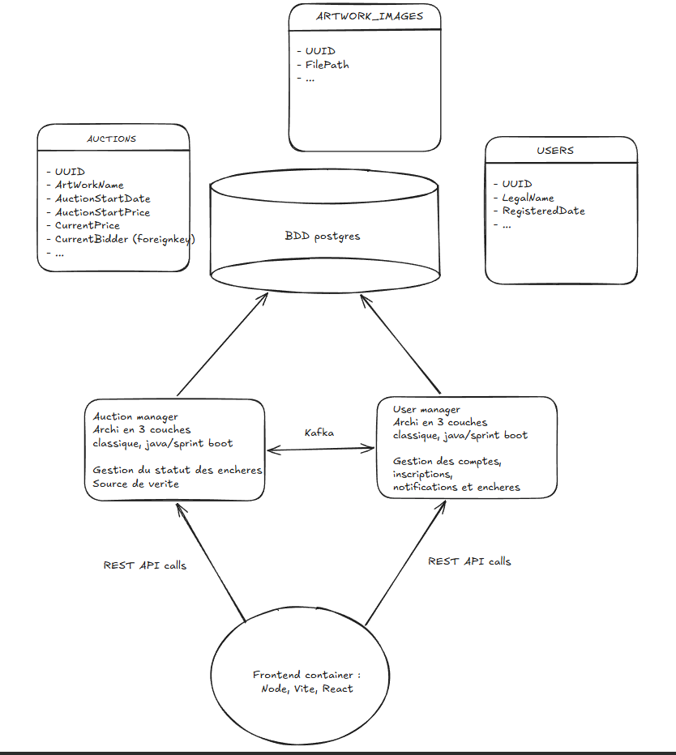

# Plateforme d’enchères d’art (luxe)

## 1. Business model

Notre projet est une **plateforme d’enchères d’œuvres d’art haut de gamme**, permettant à des vendeurs particuliers et artistes, ainsi qu’à des musées et collectionneurs, d’acheter et vendre des œuvres en ligne dans un cadre sécurisé et premium.

### Pourquoi ce projet ?
- Digitaliser un marché de l’art encore très “offline”, peu accessible à tous.
- Offrir une **expérience luxe** (design, parcours, services) à des collectionneurs exigeants.
- Proposer aux individus et aux institutions (musées, galeries, etc.) un canal moderne pour trouver de nouvelles œuvres et échanger avec d’autres intermédiaires.

### Modèle de financement
- Commission unique de 5 % prélevée sur le montant final de chaque transaction, dans la limite de 100 000€ par vente.
- Frais de service transparents pour les intermédiaires car intégrés dans tous les contrats d'achat. 

## 2. Profils utilisateurs

Nous structurons le produit autour de plusieurs **personas** majeurs :

### Patrice du Bas-Marais (vendeur particulier)
- Besoins :  
  - Vendre des tableaux hérités dans une interface **accessible** (gros boutons, peu de complexité).  
  - Catégoriser ses annonces (tableau, meuble, sculpture, etc.).  
  - Trouver des annonces similaires et les **trier par prix** pour mieux positionner ses propres ventes.

### Linguine Pepperoni (artiste star)
- Besoins :  
  - Définir des **prix minimum / prix de réserve** sur ses ventes.  
  - Disposer de **statistiques de performance** d’enchère (nombre de bids, progression des prix, ROI).  

### Charles-Antoine de Miremont d’Estrétefonds (grand collectionneur)
- Besoins :  
  - Parcours client **simple et intuitif**, qui met en avant les meilleures œuvres et où il ne rate aucune pièce importante.  
  - Section **“luxe”** distincte du reste (œuvres très chères, front épuré, design premium).  
  - Notifications/alertes sur les enchères de ses artistes/segments favoris.

***

## 3. Sprints et User Stories
Projet sur ~4 semaines d'école, découpé en 4 sprints d'une semaine, le premier ayant pour objectif le Minimum Viable Product.
Le sprint 0 (configuration du CI/CD, Fondations BDD), sera fait sur le temps entreprise, avant le début du projet le 16 mars 2026.

📈 [Voir le tableur en ligne](https://docs.google.com/spreadsheets/d/1IZnBsGDOIUUK_5uHuqVDcoay6Ql73ns0x86FimomNBE/edit?usp=sharing)

## 4. Mode de collaboration

- Git flow simple :  
  - `main` (stable)  
  - `feature/<service>-<issue>`  
- Issues / Kanban (GitHub/GitLab) pour suivre les user stories & tâches.
- Revues de code obligatoires via MR/PR.
- Daily / point rapide asynchrone (Discord/Slack) + point de fin de sprint.

## 5. Architecture technique (stack)

### Vue d’ensemble

L'architecture repose sur un modèle de microservices découplés communiquant via Kafka, avec une persistance des données sur PostgreSQL :

- **Auction Manager (Java / Spring Boot)**
    - **Rôle :** Source de vérité pour le statut des enchères et des œuvres.
    - **Responsabilités :** Gestion du catalogue (`ARTWORK_IMAGES`) et cycle de vie des objets (`AUCTIONS`).
    - **Kafka :** Produit les événements `auction.created` / `auction.ended` ; consomme les offres validées.

- **User Manager (Java / Spring Boot)**
    - **Rôle :** Gestion des comptes, inscriptions et interactivité.
    - **Responsabilités :** Profils utilisateurs (`USERS`), notifications et réception des offres (Bids).
    - **Kafka :** Transmet les offres au service Auction ; consomme les mises à jour pour notifier les clients.
 
- **Frontend (MVP)**
  - Framework React choisi pour sa simplicité et sa popularité.
  - NodeJS pour le développement + NPM pour la gestion des dépendances.
  - Builder Vite pour une configuration et des build rapides, ainsi que sa compatibilité avec les modules ES et `serve` pour servir le frontend.
  - Fonctionnalités :
    - Parcours vendeur (créer une enchère).
    - Parcours acheteur (voir œuvres, filtrer, placer une enchère, suivre le statut).
   
Autres éléments techniques :
- **Base de données** : PostgreSQL (un schéma par service ou BDD séparée selon le temps).
- **Communication inter-services** : REST + Kafka.
- **Documentation API** : Swagger / OpenAPI via Springdoc.

### Workflow : De la mise en vente à l'enchère

Le flux de données suit une logique événementielle pour garantir la cohérence entre les services :

1. **Création (Mise en enchère) :** Le vendeur soumet l'œuvre via le **Frontend**.
  * L'**Auction Manager** enregistre l'entrée en base (UUID, ArtworkName, StartPrice) et publie un message `auction.created` sur **Kafka**.
2. **Notification :** Le **User Manager** consomme l'événement et notifie les utilisateurs potentiellement intéressés.
3. **Enchère d'un autre utilisateur :** Un acheteur place une offre via le **Frontend**. 
  * Le **User Manager** intercepte l'appel, vérifie l'identité du compte et émet un événement `bid.placed` sur **Kafka**.
4. **Mise à jour du prix :** L'**Auction Manager** reçoit l'offre, vérifie qu'elle est supérieure au `CurrentPrice` actuel, puis met à jour la table `AUCTIONS` avec le nouveau montant et l'UUID du `CurrentBidder`.

***

## 6. Plateforme DevOps

Objectif : rendre le projet **reproductible** en une commande.

- **Gestion de code** : Git (GitHub / GitLab).
- **CI** :
  - Outil : GitHub Actions / GitLab CI.
  - Jobs : build, tests unitaires et d’intégration, rapport de couverture.
- **Dockerisation** :
  - Une image Docker par microservice.
  - Images pour Kafka + ZooKeeper + base(s) de données.
- **docker-compose** :
  - Fichier permettant de lancer la stack complète :
    - microservices + Kafka + DB + front.
  - Utilisé pour :
    - Environnement de dev local.
    - Environnement de CI pour tests d’intégration/e2e.

- **Monitoring / Observabilité** :
  - Endpoints de santé (`/actuator/health`).
  - Logs structurés (JSON ou pattern homogène).
  - Possibilité d’ajouter un endpoint “/info” pour exposer la version de la release.

***

## 7. Pipeline CI/CD & Release v1

### Étapes de pipeline

À chaque push / pull request :

1. **Build**
   - Compilation des microservices (Maven/Gradle).
   - Build du frontend (si applicable).

2. **Tests**
   - Tests unitaires + rapport de couverture.
   - Tests d’intégration (services REST + Kafka si possible via docker-compose “test”).

3. **Analyse qualité (optionnelle / bonus)**
   - Lint, format.

4. **Build images Docker**
   - Build des images pour chaque microservice et le frontend avec un tag basé sur le commit ou la version.

5. **Publication artefacts (selon environnement)**
   - Pour la **Release 1.0**, les images sont poussées dans le Github Container Registry.
   - Publication d’un jar ou d’un bundle si besoin dans un repository d’artefacts.

### Jusqu’où va le pipeline ?

- En CI classique :
  - On s’arrête au **build + tests + rapport de couverture + build images**.
- Pour les environnements de démo/staging :
  - Job supplémentaire qui déploie la stack via `docker-compose` sur un serveur (ou runner) dédié.
- Pour la **version 1.0** (jour J) :
  - Tag Git `v1.0.0`.
  - Pipeline “release” déclenché sur ce tag :
    - Build + tests (obligatoire, couverture ≥ 70%).
    - Build définitif des images avec tag `v1.0.0`.
    - Push des images dans le registry.
    - Stockage de la 1.0 dans l’artefact repository.
    - Génération d’un paquet de déploiement (docker-compose + env sample) utilisé le jour de la soutenance.

### Comment on produit la v1 utilisée le jour J ?

1. Créer un tag `v1.0.0` sur `main`.
2. Le pipeline “release” se lance automatiquement.
3. À la fin du pipeline :
   - Toutes les images `v1.0.0` sont présentes dans le registry.
   - Un artefact “release” (archive ou repo) contient :
     - docker-compose “prod-like”.
     - Fichiers de configuration (variables env templates).
     - README pour déploiement.
4. Le jour J :
   - Récupération du repo + docker-compose.
   - `docker-compose pull` (si registry) puis `docker-compose up -d`.
   - Démo de la plateforme en **conditions quasi-production**.

***

## 8. Lancer le projet (from scratch – aperçu)

1. Cloner le dépôt.
2. Installer Docker & Docker Compose.
3. Générer les artefacts locaux :
   - `mvn clean install` ou `./gradlew build` pour tous les services.
4. Lancer la stack :
   - `docker-compose up --build`.
5. Accéder :
   - Backend APIs via `http://localhost:<port>/swagger-ui`.
   - Front via `http://localhost:<port_front>/`.
6. Lancer les tests :
   - `mvn test` / `./gradlew test` ou via la commande fournie dans le README CI.

*(Les commandes exactes seront ajustées au fur et à mesure que le repo se structure.)*

---

*(Le README final contiendra des instructions détaillées pour chaque étape, ainsi que des captures d’écran ou gifs pour faciliter la prise en main. Pour l'instant, tout est susceptible d'évoluer.)*

## Collaborators
Cristian MESINA, Onur GENC, Quentin DUMONT, Axel MARAIS, Aurelient HURAND
