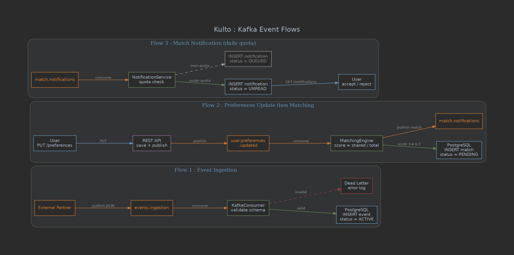
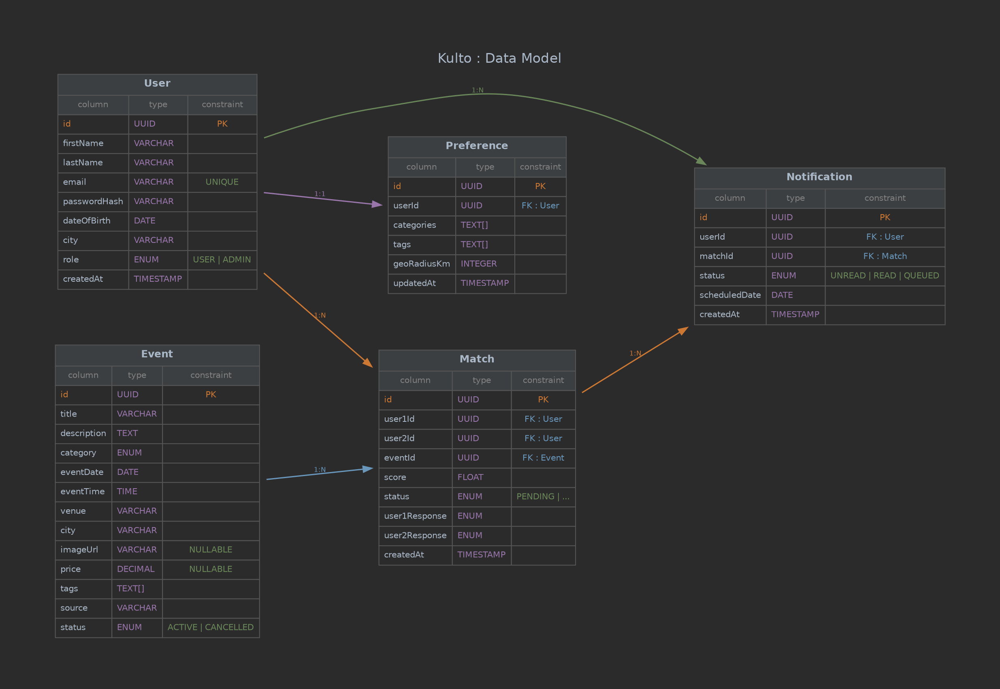

# Kulto: Conception & Architecture Document

**Version** 1.0.0 | Milestone 1 | February 2026

---

## 1. Functional Vision

### 1.1 Problem Statement

Meeting apps are built around looks and romance. Kulto addresses a different gap: people who want to find someone to go see a movie with, attend a concert, or visit an exhibition without it being a date.

Kulto is a cultural matching platform. It connects users around real-world cultural events (cinema, concerts, exhibitions, theatre, festivals) based on shared taste, not profile pictures. Events are sourced from external partners (Ticketmaster, TMDB, local event APIs) and ingested asynchronously via Kafka. A daily quota system caps the number of match suggestions per user to maintain signal quality.

Target audience: urban young adults, 18-35.

### 1.2 User Profiles

**User**: registers, sets cultural preferences (film genres, music types, interest in theatre, contemporary art, etc.), receives daily match suggestions, and accepts or rejects them. A mutual match lets both parties coordinate their outing.

**Admin**: manages the event catalog (full CRUD), moderates user profiles, configures platform parameters (notification quotas, cultural categories), and accesses usage statistics.

**External Partner (system)**: a third-party system (not a human) that publishes cultural events into the `events-ingestion` Kafka topic. A consumer on the Kulto side validates, transforms, and persists the data.

### 1.3 MVP Scope (v1.0.0)

Full backlog with acceptance criteria: [user-stories.md](./user-stories.md)

The MVP covers:
- User registration and authentication (JWT)
- Event CRUD (admin)
- Event listing with filters (category, date, city) and detail view
- User cultural preferences
- Event ingestion via Kafka (external partners)
- Simple matching engine based on shared tags between users + compatible event
- Match notifications with daily quota
- Accept / reject a match

Out of scope for MVP (v1.1+): group outings, in-app chat, outing history, post-outing ratings, ML-based recommendations.

---

## 2. Organization & Planning

Detailed sprint breakdown: [sprint-planning.md](./sprint-planning.md)

| Sprint | Period | Goal | Milestone |
|--------|--------|------|-----------|
| 0 | Feb 19 – Feb 26 | DevOps setup, conception document | M1 |
| 1 | Feb 26 – Mar 12 | Event CRUD, Kafka ingestion, data model | - |
| 2 | Mar 12 – Mar 27 | Users, preferences, matching, notifications | M2 (MVP) |
| 3 | Mar 27 – Apr 15 | Testing (coverage >= 70%), hardening, prod CI/CD | - |
| 4 | Apr 15 – Apr 24 | Stabilization, release 1.0, demo | Release |

Methodology: adapted Scrum, 2-week sprints, async daily standups on Discord, review and retro over video call. All PRs require at least one reviewer and a green CI pipeline before merge.

Tooling: GitHub Issues + GitHub Projects (Kanban board).

---

## 3. Architecture & Tech Stack

### 3.1 Architecture Overview


The system uses a **modular monolith** architecture. We ruled out microservices: with a 4-person team and 2 months to ship an MVP, the overhead of distributed deployment (orchestration, service discovery, network debugging) does not pay off. The business domain is cohesive enough to live in a single process. Each functional area is isolated in its own Java package with clean boundaries, making future extraction into standalone services straightforward if the need arises.

See [ADR-0001](./adr/0001-microservices-kafka.md) for the detailed rationale.

### 3.2 Internal Modules

```
com.kulto
├── api/              REST controllers (Spring MVC)
│   ├── event/
│   ├── user/
│   ├── preference/
│   ├── match/
│   └── notification/
├── domain/           Entities, DTOs, enums
├── service/          Business logic
│   ├── matching/     Matching engine (shared tags, scoring)
│   └── notification/ Quota management, delivery
├── kafka/            Producers & Consumers
├── repository/       Spring Data JPA
├── config/           Security, Kafka, CORS
└── exception/        Centralized error handling
```

### 3.3 Components

| Component | Stack | Responsibility |
|-----------|-------|----------------|
| REST API | Spring Boot 3, Java 21 | CRUD endpoints, resource serving |
| Kafka | Apache Kafka 3.x | Async messaging backbone, 3 topics |
| Database | PostgreSQL 16 | Relational storage (events, users, preferences, matches) |
| Frontend | React 18, Vite | SPA consuming the REST API |
| Reverse Proxy | Nginx | Serves the React production build |
| Infrastructure | Docker, docker-compose | Full-stack containerization |

### 3.4 Kafka Topics

| Topic | Producer | Consumer | Trigger |
|-------|----------|----------|---------|
| `events-ingestion` | External partner | Kulto consumer → persist to DB | New event published |
| `user-preferences-updated` | Kulto API (profile update) | Matching Engine → recalculate | User updates preferences |
| `match-notifications` | Matching Engine | Notification Service → quota check + delivery | New match found |



### 3.5 Data Model



The database uses PostgreSQL 16 with 5 core entities:

- **User**: registered accounts with role (USER or ADMIN) and city
- **Preference**: cultural preferences linked 1:1 to a user (categories, tags, geographic radius)
- **Event**: cultural events with category, date, venue, city, source (manual or ingested via Kafka)
- **Match**: a proposed outing between two users around a specific event, with individual accept/reject responses
- **Notification**: match suggestions delivered to users, with daily quota management (UNREAD, READ, QUEUED)

### 3.6 Security

**Input Validation**: all incoming data passes through DTO classes annotated with Jakarta Bean Validation constraints (@NotBlank, @Email, @Size, @Future, etc.). No entity is ever exposed directly to the API. Each controller receives a validated DTO and the framework returns 400 Bad Request with a structured error body if validation fails.

**Error Handling**: a centralized @RestControllerAdvice handles all exceptions and maps them to consistent HTTP responses:

| Exception | HTTP Code | Body |
|-----------|-----------|------|
| Validation error | 400 | field, message, rejectedValue |
| Authentication failure | 401 | message |
| Forbidden (wrong role) | 403 | message |
| Resource not found | 404 | message |
| Duplicate email | 409 | message |
| Unexpected error | 500 | generic message (no stack trace) |

**Authentication**: Spring Security with stateless JWT. Registration returns a token, login returns a token. All write endpoints require a valid token. Admin endpoints require ADMIN role. Public endpoints (event listing, event detail) are open.

**Security Audit**: a dedicated security review is planned during Sprint 3. The review will be conducted using a prompt-based agent with the role "expert senior en securite". The agent will audit the API endpoints, the JWT implementation, the input validation coverage, and the Kafka message validation. Findings will be documented in `docs/security-audit.md`.

### 3.7 DevOps

**Source control**: GitHub (private repo), GitFlow branching (`main`, `develop`, `feature/*`, `hotfix/*`). Squash merge recommended.

**CI/CD** (GitHub Actions), triggered on every push/PR to `develop` or `main`:
1. Maven build (`mvn clean package`)
2. Test execution + JaCoCo coverage report (threshold: 70%)
3. Docker image build (backend + frontend)
4. Push to GitHub Container Registry (`ghcr.io`)

**Packaging**:

| Artifact | Contents | Image |
|----------|----------|-------|
| Backend | Spring Boot fat JAR | `ghcr.io/<org>/kulto-backend` |
| Frontend | React build served by Nginx | `ghcr.io/<org>/kulto-frontend` |

**Launch**: `docker-compose up -d` starts the full stack (backend, frontend, PostgreSQL, Kafka, Zookeeper).

**API Documentation**: Swagger UI (springdoc-openapi) is available at `/swagger-ui.html` in development. The OpenAPI spec is auto-generated from the controller annotations and DTO validation constraints. This is integrated starting Sprint 1 and kept up to date throughout development.

### 3.8 Risk Management

| Risk | Likelihood | Mitigation |
|------|------------|------------|
| No prior Kafka experience on the team | High | Sprint 0 includes a standalone Kafka POC |
| Matching algorithm scope creep | Medium | MVP uses shared-tag scoring only; ML deferred to v1.1 |
| Test coverage below 70% | Medium | JaCoCo integrated from Sprint 1; Sprint 3 fully dedicated to testing |
| External APIs unavailable | Medium | Mock dataset seeded in DB + Kafka simulator for dev |
| Git conflicts / broken develop | Low | Mandatory PR reviews, CI gate before merge |
| End-of-project overload | Medium | Strict MoSCoW prioritization, minimal but functional MVP |
